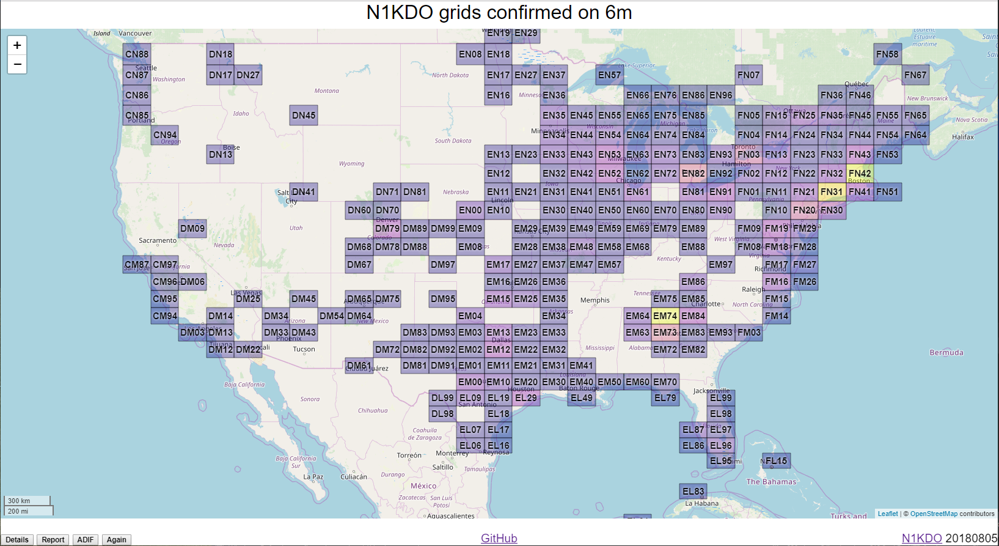

# lotw-gridmapper

`lotw-gridmapper` is a toy I made because I wanted it and 
I wanted to learn how to use Google Maps to display data.
(20250512 note: I switched this to Open Street Maps using Leaflet in 2019.)

There are two pieces.

* 6mGrids.html contains the just about everything except

* lotwreport.php is a proxy for the "real" lotwreport.adi web service on ARRL's web site.  
  The proxy is used to get around the browser's "single-origin policy"  -- data loaded from 
  web requests must come from the same host as the web page.
  (20250512 note:  the php endpoint is obsolete and has been replaced with lotwreport.py)
 
If you decide to play with this, please get your own Google Maps
API Key.

I might do more work on this, or I might not.

n1kdo 20170709 and again 20250512
